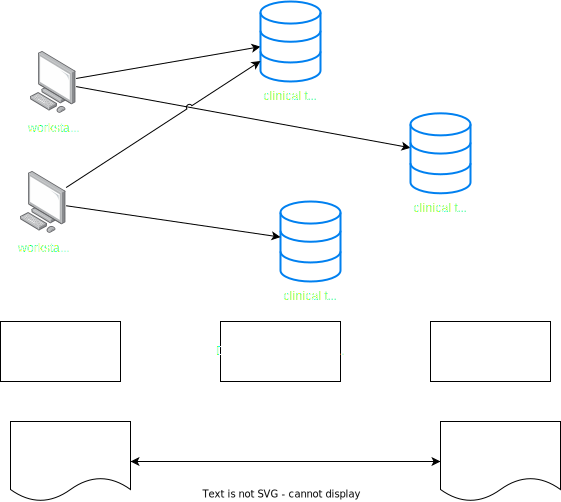

# Example how to create subnets with Bicep

## Ingredients:
- Folder `vnet`, that contains a deployment for a vnet including all subnets
- Folder `subnet`, that contains a mapping from Json to Subnet properties and also is able to deploy the last or all subnets from the json definition
- `subnets.json`, that contains the subnet definitions

Play through the scenario:
1. Run the main VNET deployment (since yeah, you need a VNET)
    ```bash
        az deployment sub create \
            --name "vnet_subnet_test" \
            --location "westeurope" \
            --template-file ./vnet/main.bicep 
    ```
2. Add a subnet to the end of the subnets.json
3. Deploy this additional subnet imperatively
    ```bash
        az deployment group create \
            -g "rg-vnet-test" \
            --name "add_subnet_test" \
            --template-file ./subnet/main.bicep \
            --parameters deploySubnetNames="['trial-7']"
    ```
4. Now you can either add more or also at any time execute step 1 again.
5. You can also deploy certain subnets imperatively, here it deploys subnet `trial-7`
     ```bash
        az deployment group create \
            -g "rg-vnet-test" \
            --name "add_subnet_test" \
            --template-file ./subnet/main.bicep \
            --parameters deploySubnetNames="['trial-7']" 
    ```



## Challanges
- ARM/Bicep only supports nested loops and conditional loops on Modules and Resources, not in any other places